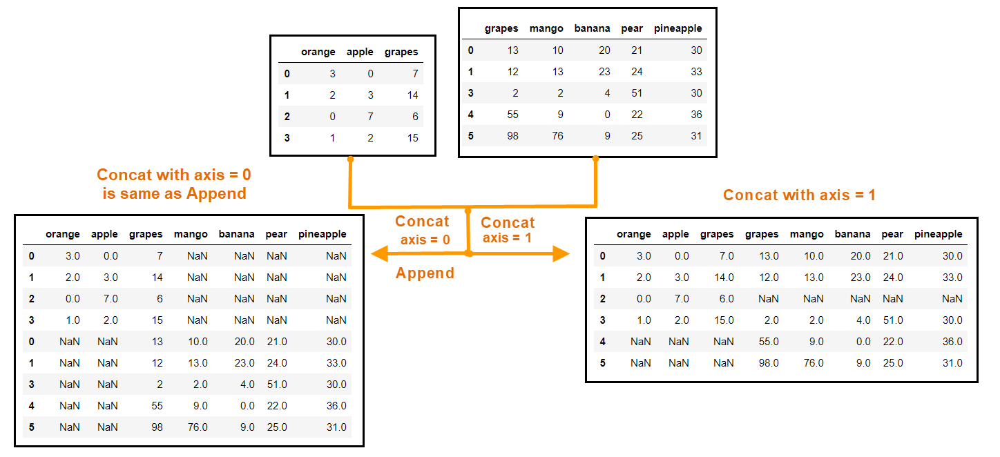

# Lesson 1 : Series

## Intro to Attributes

* s.values
* s.index
* s.dtype
* s.is_unique ( is every value unique )
* s.name
* s.size
* s.shape

## Intro to Methods

* s.sum()
* s.mean()
* s.product()
* s.medain()
* s.mode()
* s.describe()
--------------
* s.sort_values()
* s.head()
* s.tail()
* s.sort_index()
* s.get(keys , default = None)
* s["a" : "b"]
* s.count() 
  *  excludes NaN values
* s.idxmax() 
  *  index position that has the smallest value
* s.idxmin() 
  *  index position that has the largets value
* s.value_counts()
  *  Takes all the values and tells how many times each value appers
  *  important method
*  s.apply(fxn)
   *  apply a method all the values of the series
*  s.map(series_2) 
   *  maps values of s to indices of series_2 and returns a new series 

```
## map illustration

pokemon_types = pd.read_csv("pandas/pokemon.csv", index_col="Pokemon", squeeze=True)
pokemon_types.head(3)

pokemon_names =  pd.read_csv("pandas/pokemon.csv", usecols=["Pokemon"], squeeze=True)
pokemon_names.head(3)

pokemon_names.map(pokemon_types).head(3)
```

# Lesson 2 : Data Frames

* Whenever a column has NaN values the values in that columns is stored as floating point numbers
----
* df.head()
* df.tail()
* df.describe()
* df.info()
* df.index
* df.values
* df.shape
* df.dtype
* df.columns
* df.axes
----
* df.sum(axis = 1/0)
* Extract a column from df
  - df["Name"]
* Extract Two or more Columns from a df
  * df[["Name", "Number", "Position"]]
* Add new Column to df
  * df["sport"] = "Basketball"
  * df["sport"] = some_series
  * df.insert(pos, column = "sport", value = "Basketball")
  * df.insert(pos, column = "sport", value = maybe a series)
  
* Broadcasting Operations
  * df["Age"] + 5
  * df["Age"] - 5
  * df["Age"] * 5
* Review of `value_counts`
  * It is available only for series
  * extraxt a series and do `value_counts`
* drop NaN values
  * df.dropna(inplace = True)
  * by default any row having NaN will be removed
  * You can change this way using **how** parameter
  * df.dropna(**axis = 1**), any columns having NaN values are dropped
  * df.dropna( **subset = ["Salary"]**), only if NaN is in salary column that particular row is dropped else it is not dropped
* Fill in Null Values with `.fillna()` Method
  * direct df.fillna(0) doesnt make sense all the time
  * Call on each series indivudually
  * df["Salary"].fillna(0, inplace = True)
  * df["College"].fillna("No College", inplace = True)
* The `.astype()` Method
  * Remove all the NaN values
  * df["Salary"].astype("int")
  * df["College"].astype("String")
* `category` data type in Pandas
  * df["Position"].astype("category")
  * If the unique values are very less in number

* `sort_values` on df
    * df.sort_values("Name", ascending = True)
    * Change the NaN position bu using **na_position** parameter
    
* `sort_values` on multiple columns
    * df.sort_values(["name", "Salary"], ascending = [True, False])
    
* `sort_index`
    * df.sort_index( ascending = True , inplace  = True)

* `rank()` Method on Series
    * Remove Null values
    * df["Salary"].rank(ascending = False).astype("int")


## Lesson 3 : Filtering Data

* pd.to_datetime( df["Start Date"] )
    * pass a series to chnage it to the datetime type


* Initially when a Dataset is presented first change the types of columns appropriately for the furthur operations to go smooth


* Instead of manual date time change you can use **parse_dates** parameter in `read_csv()`


##### Filter Based on a Condition

* df["Gender"] == "Male" returns a boolean series

* To extract the rows following a condition pass the boolean series to df
    * df[ df["Gender"] == "Male" ]
   
   
* More than one condition
    * df[( df["Gender"] == Male ) & ( df["Salary"] > 1000000 ) ]
    * df[( df["Gender"] == Male ) |  ( df["Salary"] > 1000000 ) ]
    
    
* `isin()` Method
    * It optimizes the above process
    * df["Team"].isin(["Marketing", "Legal"]) returns a boolean series whenever the column has Marketing ot Legal
  
  
* `.isnull()` and `.notnull()` Methods
    * df["Team"].isnull() returns a boolean series
    * df["Team"].notnull() returns a boolean series
   
   
* `.between()` between lower bound and upper bound
    * df["Salary"].between(60000,700000) returns a boolean series
    * can take dates, times, floats
        

* `.duplicated()` -> boolean array on a series
    * df["First Name"].duplicated( keep = 'last'/ 'first'/ False)
    * False implies all the duplicates are cosidered duplictes
 
 
* `drop_duplicates()`  applicable on a DF
    * by default drops only rows that are completely the same
    * df.drop_duplicates( subsets , keep ) 
    
    
* `.unique()` and `nunique()` on a series
    * gives unique values -> `.unique()`
    * gives number of unique values -> `.nunique()`
   

## Lesson 3 : Data Extraction

* `set_index()` and `reset_index()`
    * df.set_index( keys = "Film" ) , makes Film column the index
    * df.reset_index(), back to the numerical indexing
    * you can drop the exisiting index using **drop**
    
    
* Retrive Rows using `.loc[]` 
    * df.loc["A index name"]
    * Remember Indexes could be the same ( no problem )
    * supports list slicing, df.loc["Diamonds Are Foreevr": "Saccred Eye"]
    * Right end point is included
    * All the python slicing methods works
    
    
* Retrieve Rows using index location
    * df.iloc[1:5]
    * df.iloc[1:15:3]


* second Arguments to `loc` and `iloc`
    * df.loc["Arow_name", "Acol_name"]
    * df.loc["Arow_name", ["a1col", "a2col"]]
    * you can slice in the both the indices
    * same things apply for **iloc**
   
   
* Set a new value for a specific cell
    * df.loc["Hello","bye"] = "Something"
    * df.loc["A", ["B", "C"]] = a list


* Set Multiple Values in DataFrame
    * When you do df[df["A"] == b] this creates a new dataframe altogether and is not the original dataframe
    * df.loc[mask] this doesnt create a new dataframe rather this is just a slice from original dataframe
    * df.loc[mask, "A"] = anything
    * This is the correct method
   
   


* Remame Index labels or Column Labels
    * df.remane(mapper = dict, axis = 0), dict is a mapping function.
    * df.remane( index = dict ), same dict
    * df.rename( columns = dict ), same dict
    * for a bulk remane use, df.columns = [list]
    * for a bulk remane use, df.rows = [list]
    
    
    
* delete Rows or columns in a Dataframe
    * df.drop( labels , axis )
        * labels are the row indices
        * axis is the rows/columns
     * df.pop("Actor"), returns the Actor Col and also removes it from the dataframe
     * del df["Director"]
     

* Create Random Sample
    * df.sample(n = 5), returns a random row
        * n rows are returned
        * frac is the percentage of 
        * axis = 0/1
      
      
* `.nsmallest()` and `.nlargest()`
    * df.nlargest(3, columns = "Box Office")
    * df.nsmallest(3 , columns = "Box Office")


* Filtering with `.where()` method
    * df.where(mask), it returns the whole df but keeps NaN in all the rows where the row is not filtered
    

* Filtering with `.query()` Method
    * For this to work the columns names should not have spaces
    * but this looks very wierd I dont want to use it
  
 
* Apply Method with Row Values
    * create a function fxn(row) , this takes each row as a argument and gives a value
    * df.apply(fxn, axis = 'columns'), the columns here is a little bit confusing just read up Documentation


* Create a copy of DataFrame with `.copy()`
    * directors["A View to kill"] this is chuck of origianl dataframe and effects the original
    * df.copy()
    * df["Director"].copy()
    

## Lesson 5 : Working Text

* Common String Methods
    * `.lower()` 
    * `.upper()`
    * `.title()` -> first char of each word is captilized and all others are made lower
    * `len()`
    *  when called on a column the syntax is as follows
    * df["A"].str.lower()
    * str prefic must be given before using the method
    * df["A"].str.upper()
    * df["A"].str.title()


* `.str().replace()`
    * "Hello World".replace("l","!") -> replaces all the instances of l with !
    * df["D"].str.replace("MANGT", "Management")
    * df["A"].str.replace(",","")
    
    
* Filtering with String Method
    * df["A"].str.contains("Hello") -> returns true if it contains the substring
    * df["A"].str.startswith("Hello") -> only starts with Hello
    * df["A"].str.endswith("Hello") -> only ends with Hello


* `strip()` & `lstirip()` & `rstrip()`
    * removes whitespaces from beggining, last, or both accordingly
    * df["A"].str.lstritp()
    * df["B"].str.rstrip()
    
    
* String methods on Index and Columns
    * df.index.str.strip().str.title()


* `.split()`
    * "Hello my name is Boris".split(" ") -> ['Hello', 'my','name','is','Boris']
    * df["A"].str.split(",")
    * df["A"].str.split(",").str.get(0) -> gets 1st element from each list
    * **get** and **split** are complementaory
   
 
* `.split()`
    * **expand** parameter generates a dataframe rather than a series
    * **n** parameter determins maximum number of splits we can do

## Lesson 6 : Multi Index

* use set_index and pass it a index to get multi index
    * Use the column with least unique values to be the outer most level
    * The order in the array  effects the indexing
    * sort_indices sorts each layer
    * df.index returns array of tuples
    * so we need two ids to idexntify a value
    
* `get_level_index()` 
    * df.index.get_level_index(0) returns the index values at that level. 


* Change the names of the indexes
    * df.index.set_names(names , Level , inplace ) 
    * names is a list or a label
    * Level is the level which you want to change


* `sort_index()`
    * You can sort each level or only a single level using the appropriate parameters
    * But when the higher levels are individually sorted the grouping by lower levels will not remian intact
    
    
* Extract Rows from MultiIndex
        * important
        
    * Remeber `.loc` for normal dfs, the first argument is a row index and the second index is a column index
    * The same syntax is preferred here
    * So the first index must be a tuple( not list ) of required multiIndex and second index must be a label or a list of column names
    * There is not such problem with `iloc` accessor
    * Every row is given a unique index number wrt row
    
    
* Remember that there could be multiIndex in Columns as well as in Rows. So all of this appleis to column multi index as well. 


* Each of the entries in `loc` accessor must be a tuple when dealing with multi Indices


* `swaplevel`
    * df.swaplevel() swaps levels 
    
* `stack()` 
    * Takes the column values and makes them into index values
    

* `to_frame()` 
    * converts series into dataframe
    
    
* `unstack()`
    * Takes the index and makes it into a column
    * You can use a combination of stack and unstack to methods to get the shape you want
    * you can pass in arguments to say which layer should be unstacked outer most layer is 0th layer
    * inner most layer is -1
    * you can also pass in a list to move multiple layers at once
    * you can use **fill_na** parameter to fill in the NaN values
    
   
* `pivot()`
    * you can align/ condense along the common values
    * practice this for more efficieny
    * choose the index values , column values and values which needs to be at their intersection
    
    
* `pivot_table()` method
    * you can aggregate on a column based on a different column grouping
    * very impotant method
    
    
* `pd.melt()`
     * opposite of melt
     * all the indxes are melted into a single row
     
```
## Pivot Table Illustration
df  = pd.read_csv("pandas/salesmen.csv" , parse_dates=["Date"])
df["Salesman"] = df["Salesman"].astype("category")
df.head(3)

df.pivot(index = "Date" , columns= "Salesman" , values="Revenue" )

## Pivot Table Illustration
food = pd.read_csv("pandas/foods.csv")
food.head()

food.pivot_table(values = "Spend", index = ["Gender","Item"], columns="City")
```

## Lesson 7 : Groupby 

* Ideal thing to groupby is the column having less unique values


* df.groupby("Sector")
    * It creates a lot of smaller data frames that are created by using the column Sector 
   
   
* len(groupby_obj) -> number of groups. Each corresponding to a unique value of the coumn


* `sectors.size()` -> number of rows in each group
    * it is similar to value counts() method

* `sectors.first()` -> extracts first row of each group


* `sectors.last()` -> extracts last row of each group


* `sectors.groups` -> returns a dictionary, keys are unique value, values are list of index values corresponding to orginal dataframe


* Retrieve a group using `get_group()`
    * sectors.get_group("Energy") -> gives a dataframe that has Energy in sector column
    
    
* `sectors.max()` -> from each group it gives the max of each group on the last column


* `sectors.sum()` -> gives sum across each column of every group


* `sectors.mean()` -> gives mean across each column of every group


* `sectors["Revenue"].sum()` -> gives sum across only Revenue column ( rather than the whole group )


* Grouping by multiple columns
    * d.groupby(["A"], ["B"] )
    * it is grouped by first A and then by B
    
    
* `.agg()`
   * sectors.agg(dict)
   * dict has column names as key and aggregates as values
   * you can also apply multiple operations to different columns by using list
   * Advanced Usage
      * agg( new_col_name = ('old_col_name' , aff_fxn), new_col_name1 = ('old_col_name', agg_fxn_1, .... )


* Iterate through all the groups 
    * 
    ```
    for sector.data in sectors()
        df.append(data.nlargest(1, "Revenue"))
    ```
    

## Lesson 8 : Merging, Joining, Concatenating DataFrames

* `pd.concat` 

    * By default the index is also sticked, use `ignore_index` to diable this
    * `keys` makes the result a multi index Data frame, keys become the outermost index
   
   
* `df1.append(df2)`

    * No inplace parameter, assign it to new df
    
    
* Inner joins
    * In venn diagrams the intersection is what the Inner Joins returns
    * The operation is simple if they have same column names
    * `week1.merge(week2) `
    * `on` works only if they have same name, this is what the intersection is taken on
    * By deafult all the possible combinations are taken in the result
    * `suffixes` can be used to add it to the other columns
    * `how` is inner in this case
    
    
* Inner joins across multiple columns
    * To match on different columns give a list to `on` parameter
    * There can still be duplicates if there are duplicates in the origianl data frames
   
   
* Outer Joins
    * `week1.merge(week2, how = 'outer', on = 'some col')`
    * It is (or) operation thats being done
    * `indicator` states where the entry is made from ( eg: right_only/both/left_only )
    * use indicator to get `xor` operation


* Left Join
    * Similar to `vlookup` in excel
    * Use one of the df as a foundation and pull up data from the other dataframe only if its there in the foundational data frame
    * `week1.mereg(foods, how = 'left', on = 'Food ID')` the column name must be present on both
    * Right is very similar ( Just change the order ) 
   
 
* Names of the columns are Differnt 
    * `left_on` & `right_on` paramters can be used to solve this issue
    * use `drop` to reomve the column that has same values


* Merging by Indexes with left_index and right_index Parameters
       
     * `left_index` and `right_index` can be used if you want to merge on indices( rather than the columns )
     
     
* `.join()` menthod 

    * append but on the other axis
    
    * Easy shortcut, concate nate vertiaclly when two data frames share the same index.
    
    
* `pd.merge`
    
    * Just an alternate syntax, we have been calling on data frame previously
    
    * `right` & `left` paramters will specify the left and right data frames

* `pd.concat` vs `pd.append`

  

  Image credit: [Asha Ponraj]((https://medium.com/analytics-vidhya/a-tip-a-day-python-tip-5-pandas-concat-append-dev-skrol-18e4950cc8cc)) 

  * Append is a specific case of concat, append is just adding by rows ( new rows are added to the dataframe )

  ```Python
  pd.concat([df1, df2, df3], axis = 0/1])

  df1.append(df2)
  ```

## Lesson 10 : Working with DateTime Module

```Python
import datetime as dt
```

* `dt.date()` & `dt.datetime()`
    
    * `someday` = `dt.date(2016, 4, 12)`
    
    * `someday.year, someday.month, someday.day`
    
    * sometime = `dt.datetime(2016, 1, 12, 8, 13, 57 )` 8:13:57 on 12/1/2016
    
    * `str(someday)` 
    
    * `someday.year, someday.month, someday.hour, someday.minute. someday.second`
    
* The pandas **`Timestamp`** Object
    
    ```Python
    pd.Timestamp("2015-03-31")
    pd.Timestamp("2015/03/31")
    pd.Timestamp("2015, 03, 31")
    pd.Timestamp("19/12/2015")
    pd.Timestamp("2015-03-31 08:35:15 PM")
    pd.Timestamp("2015-03-31 21:35:25")` 
    ```
    
    * `pd.Timestamp(dateimeobj)`
    
    
* The pandas **DateTimeIndex** Object

    It is a container to all the Date time objects

    ```Python
    pd.DatetimeIndex(dates) , dates =["2015-03-31", "2015/03/31"]
    ```
    
    This will be used as Index of a Dataframe or series
    
    
* The `pd.to_datetime()` Method
    
    Used to convert series to a DatetimeIndex
    
    ```Python
    pd.to_datetime(series, errors, unit )
    ```
    
    `errors` : `coerce` , this converts anything thats not compatable to a NaT ( not a time )
    
    `unit` : `s` , used when Unix times are involved
    
* Create Range of Dates with the `pd.date_range()` Method, Part 1
    
    ```Python
    pd.date_range(start, end, periods ,freq)
    ```
    
    Excatly two of {start, end, periods} needs to be given
    
    ***Specify start date, end date( inclusive ) and frequency parameter to seperate the date range accordingly***
    
    `start` : start date
    
    `end`   : end date
    
    `freq`  : 

   *D* : One day

   *1D*: One day
   
   *2D*: Two days
   
   *B* : Buisness days only
   
   *W* : Only one day ( default sunday )
   
   *W-FRI* : Only one day (Friday)
   
   *nH* : nHour
   
   *M* : Last day of the month 
   
   *MS* : Start of each month
   
   *A* : Year end
   
  
* Create Range of Dates with the `pd.date_range(start, periods)` Method, Part 2

    `periods` : 25, number of time stamps from start
    
    starts from the `start` stamp and generates period number of stamps according to freq
    
* Create Range of Dates with `pd.date_range(end, periods)` Method, Part 3

    starts from the `end` stamp and generates period number of stamps according to freq
    
   
* The `.dt` Accessor

  Similar to `.str` to work with series
  
  ```Python
  datetimeindex.dt.date
  
  datetimeindex.dt.weekday_name
  
  datetimeindex.dt.is_month_end
  
  datetimeindex.dt.is_quarter_start
  ```
  
* If the index of a dataframe is DatetimeIndex then all the functions of slicing, indexing etc.. works as usual


* Attributes of `Timestamp` Object

    `someday.month`
    
    `someday.week`
    
    `someday.is_month_start`
    
    `someday.is_month_end`
    
    `someday.is_quarter_start`
    
    `someday.day`
    
    `someday.month_day()`
    
    `someday.day_name()`
 
    All these operations work on DatetimeIndex as well
    
    
* The `pd.DateOffset` Object 
    
    DatetimeIndex + 5 gives ERROR
    
    DatetimeIndex + pd.DateOffset(days = 5)
    
    Other Parameters : `days`, `weeks`, `months`, `years`, `minutes`, `seconds`

* Dynamic Offsets
    
    Convert all the dates to month end
    
    stocks.index + pd.tseries.offsets.MonthEnd()
    
    Similarly, `MonthBegin()`, `BMonthEnd()`, `YearBegin()`, `YearEnd()`
    
    
* The `Timedelta` Object

    Represents a spawn of time, can be obtained by taking difference of two Timestamps
    
    ```Python
    pd.Timedelta(days, minutes, hours, seconds, weeks) 
    ```
    
    Deriving Time Delta from a string
    ```Python
    pd.Timedelta("5 minutes")
    
    pd.Timedelta("6 hours 12 minutes")
    
   ```
    
